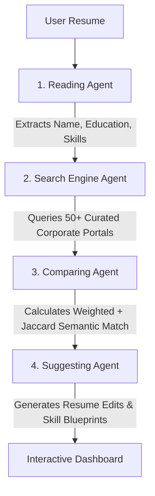

# AI Internship Assistant 🚀

A full-stack web application featuring an advanced **4-Agent Collaborative System** that analyzes candidates' resumes, searches for tailored internship openings across a diverse pool of 50+ corporate portals, calculates precise match metrics, and recommends learning paths and resume enhancements.

The application features a premium, responsive **glassmorphic dark-mode dashboard** with real-time agent progress trackers and interactive radial progress visualizations.

---

## 🛠️ The 4-Agent Architecture



1. **Reading Agent 👤**: Extracts the candidate's actual name, academic history, and technical skill set directly from the resume file.
2. **Search Engine Agent 🔍**: Scans a comprehensive, curated repository of **50+ diverse companies** (across tech, fintech, healthcare, aerospace, consulting, and startups) and retrieves official direct career portal links (no generic aggregator redirects).
3. **Comparing Agent 📊**: Calculates a precise Match% score using a hybrid formula: **50% weighted key skill matching** + **50% semantic skill profile similarity**.
4. **Suggesting Agent 💡**: Analyzes missing skills against top-matching roles to generate detailed "Before vs. After" resume bullet-point enhancements, resource learning paths, and hands-on project blueprints.

---

## ✨ Features

- 🎨 **Premium UI**: Glassmorphic dark-theme styled with vanilla CSS, custom SVG indicators, interactive sliders, and animated step-by-step loaders.
- ⚙️ **Robust Local Fallback**: Seamless offline support. If the Gemini API is blocked or quotas are exceeded, the application automatically triggers custom regex parsers, Jaccard-distance comparison matrixes, and local skill databases.
- 🔗 **Direct Career Portal Links**: Avoids dead ends by leading directly to official application search fields at companies like Google, Tesla, SpaceX, Stripe, Vercel, and Deloitte.
- 📂 **Multi-Format Support**: Processes both raw `.txt` and standard `.pdf` resumes.

---

## 🚀 Setup & Run Locally

### 1. Prerequisites
- **Python 3.9+**
- **Git**
- **Gemini API Key** (optional, recommended for advanced AI parsing)

### 2. Installation
Clone or download the project, navigate to the directory, and set up your virtual environment:

```bash
# Initialize and activate virtual environment
python -m venv venv
venv\Scripts\activate      # On Windows
source venv/bin/activate  # On macOS/Linux

# Install required dependencies
pip install -r requirements.txt
```

### 3. Running the Server
Set your Gemini API key and run the Flask application:

```bash
# Set environment variable (Optional: if omitted, app runs in Fallback Mode)
set GEMINI_API_KEY="your_api_key_here"  # On Windows CMD
$env:GEMINI_API_KEY="your_api_key_here"  # On Windows PowerShell
export GEMINI_API_KEY="your_api_key_here"  # On macOS/Linux

# Start the Flask app
python app.py
```
Open **[http://127.0.0.1:5000](http://127.0.0.1:5000)** in your web browser.

---

## 📦 Project Structure

```text
├── agents/                  # Multi-agent system logic
│   ├── reading_agent.py     # Parses resume details
│   ├── search_agent.py      # Connects to 50+ company portals
│   ├── comparing_agent.py   # Ranks matches via hybrid scoring
│   └── suggesting_agent.py  # Generates recommendations & blueprints
├── static/                  # Frontend assets
│   ├── css/
│   │   └── style.css        # Glassmorphic layout styling
│   └── js/
│       └── main.js          # File uploads, animations, and DOM rendering
├── templates/
│   └── index.html           # Main web dashboard interface
├── uploads/                 # Temporary resume storage (auto-cleaned)
├── app.py                   # Main Flask controller & endpoint routes
├── config.py                # API client configuration
├── utils.py                 # File reading and text parsing helpers
├── requirements.txt         # Project dependencies
└── README.md                # Project documentation
```

---

## ⚖️ License
Distributed under the MIT License. See `LICENSE` for more information.
